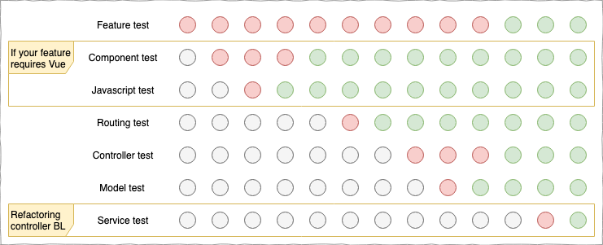

# How to Write Tests First?

_Start with the front-end, work to the backend_

This ensures that you are only developing what is necessasry to achieve the features of the story. When you are creating all your work as a result of a requirement, then there is no-opportunity to do unnecessary development.

_Repetitive tests indicate potential re-use_

If you find yourself writting a test that feels similar to one you've written before it's an indication that the code you're going to be writting is the same and has the opportunity to be re-used.

_Difficult testes indicate complex objects and potential abstractions_

If what you're trying to test is seemingly difficult to test that's usually a strong sign that the thing you are testing is too complicated and can be broken down into simpler things that can be tested easily.
