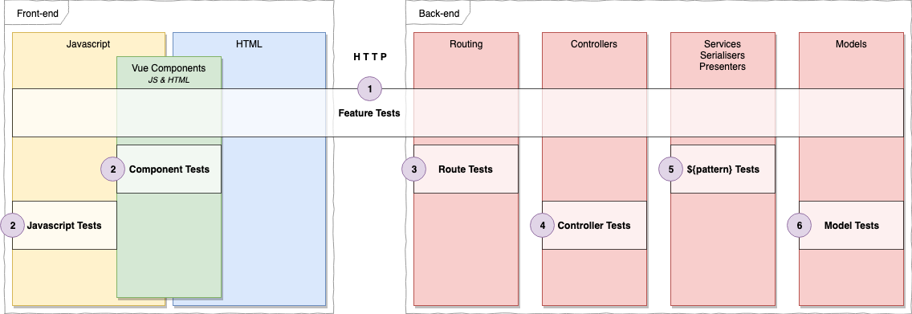

# What to test?



---
## Feature Tests

Our highest level tests, they are typically end to end integration tests. They are the most accurate in representing user interaction - however they are also the slowest and most expensive tests to use.

We aim to test what the user sees when they perform actions, however it is often faster to test that user actions create certain changes in the database.

e.g.

```ruby
scenario 'a staff clicks the add product button and fills out the name and price' do
  simulate the user action
  ...
  expect that a product has been added
end
```

---
## Routing Tests

Test request to path with specific action is recieved by the correct controller with the appropriate params.

---
## Controller Tests

Test given a specific request the controller responds accordingly and changes to the data.
Primarily testing:
- HTTP Status - `200 ok`, `404 not found`, etc
- Template Rendered (primarily useful with form resubmissions, e.g. in Rails it's typical for `update` to render `edit` if the submission was invalid)
- Assigns to instance variables if often tested - particularly in older apps.
- Changes in the data from the action.

---
## Model Tests

Test that the model has associations set up properly, validations and any other methods on the model. Often very short - particularly when taking advantage of the shoulda matchers gem.

---
## Service & Other Refactoring Object Tests

Any other pattern objects in your project, Services, Presenters, Serialisers etc.

---
## Component Tests

Component tests are the key part to being able to TDD your Vue Components without going and writting every possible component scenario in a feature test. They are fast and generally easy to work with.

As with most tests it is recommended not to test the internals, but instead test the public interface.

For components, the public interface is:
- Intitial props
- Watched prop changes
- Rendered template
- Emitted events
- Listened events

That means you shouldn't test methods, computed props directly.
This is a recommendation by the [makers of Vue](https://vue-test-utils.vuejs.org/guides/common-tips.html).

For detailed examples see [Component Specs](./component-specs.md).

---
## Javascript Tests

When you have Javascript that isn't belonging to the inside of a Components script tag, you can simply test it with traditional Jest tests.

Some examples within Fincap where we required Javascript testing:

**Vuex store** actions, mutations, getters and setters are all simply JS functions and can be imported directly and tested against.

**API classes** that encapsulate endpoints are a common way of extracting async API requests out of your components to be re-usable and more easily tested. These objects can be easily tested with Jest.

**Regex** is common in validation libraries and elsewhere in Javascript. It can be easily constantsied, imported into a Jest spec and tested thoroughly there instead of being testing within the concern of another object or component.
